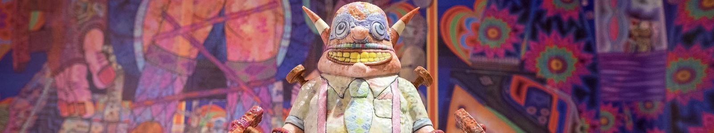

The disabiltiy interactions course has emerged from the original accessibility and assistive technology course.

The reason for the name change of the module was a philosophical one. I think of designing technology in terms of how people interact with the technology and then how this enables interactions within life. There needs to be more than just designing technology. We have to be designing technology which will enhance the interactions of life. Make it easier for people to do things, whatever things they choose.
Interactions need to be adaptable to the person's abilities and the context of use. having different modalitites of interactions helps with this.

Our module focuses on designing for people with ALS/MND. You can read all about this disease and its impact on what people can do physically with their bodies in the documentation for the module. ALS/MND is a horrible disease. It is also fatal, ultimately. This makes designing with people who have ALS/MND important but also more challenging. When people live with a reduced amount of time to live and have challenges in communicating, we must ensure our interactions do not waste the precious energy and time of people living with ALS/MND.

This combination - the fact ALS/MND affects so many aspects of a person's life, combined with the need to use the very best practices within co-design work, makes it an excellent choice for developing the disability interaction philosophy and accompanying framework.

This year as I transition the course from accessibility and assistive technology to Disability Interactions (DIX), I thought I would experiment with something I have wanted to do for quite a while – to design a process where all the people who take my module can pool their collective learnings into a resource which can be used by the wider human-computer interaction (HCI) community. This is that process. We will use [Docusaurus](https://docusaurus.io/) to develop a living resource for people wanting to design technology which helps people living with ALS/MND.